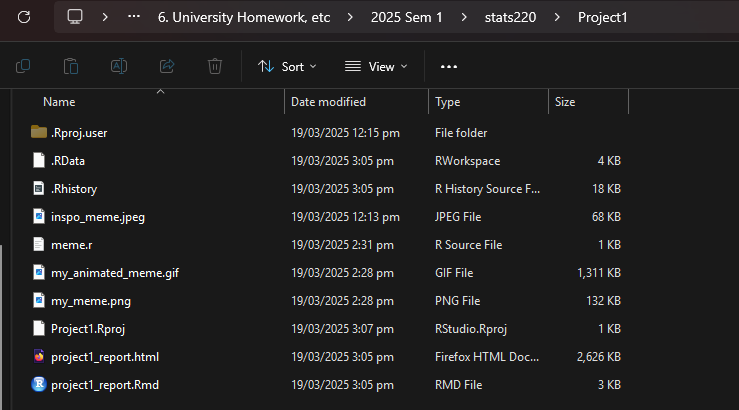
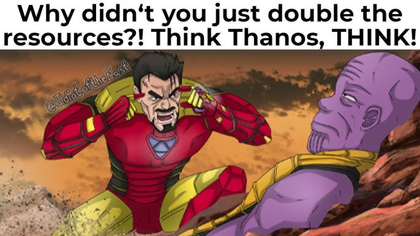
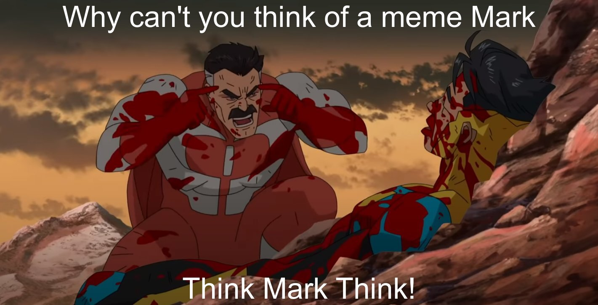
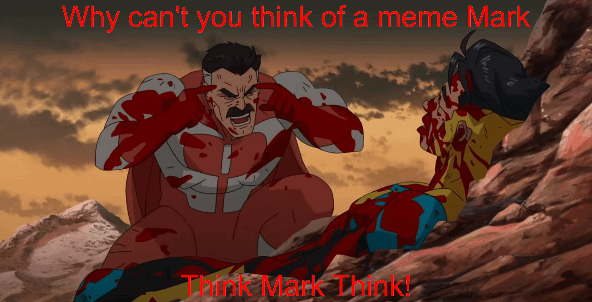

```{r setup, include=FALSE}
knitr::opts_chunk$set(echo=TRUE, message=FALSE, warning=FALSE, error=FALSE)
```

```{css}
body {
  background-color: black;
  color: white;
}
a {
  color: red;
}
h1 {
  color: red;
}
h2 {
  color: orange;
}

```

## Project requirements



[My GitHub](https://github.com/internetyh/stats220)

## Inspo meme



Inspo meme design uses the frame from invincible where he is scolding mark to make a joke about how Thanos's justification for wiping out half the universe is flawed by mocking it as a bad choice

## My meme



I couldn't think of a meme and in the process of thinking that I couldn't think of a meme I thought that would fit the template of the meme I chose perfectly

## My animated meme 



## Creativity

I used my personal experience of not knowing what meme to chose for the project to pick a meme for the project

I made a function to make changing the text color easier, and I thought that making the report into dark-mode would be a good CSS change as white websites normally hurt my eyes

## Learning reflection

I learned the basics of the magick package, although I would of liked it if the project was more demanding in terms of requirements.

Was interesting to create a GIF with R though as I didn't think that it was something that really suited a language for statistics but it makes sense upon completion of this project

I'm curious now about how R can be used with the animation and HTML to create detailed statistics reports in the future

I'm also curious to see if R has anything related to machine learning or analysing large data sets in the future

## Appendix

<mark>Do not change, edit, or remove the `R` chunk included below.</mark> 

If you are working within RStudio and within your Project1 RStudio project (check the top right-hand corner says "Project1"), then the code from the `meme.R` script will be displayed below.

This code needs to be visible for your project to be marked appropriately, as some of the criteria are based on this code being submitted.


```{r file='meme.R', eval=FALSE, echo=TRUE}

```

