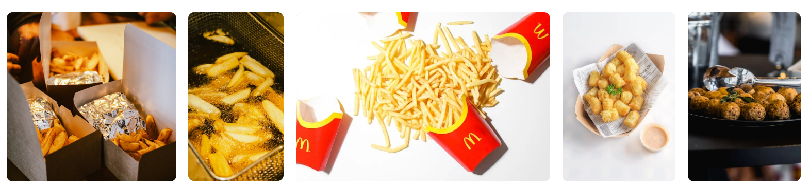
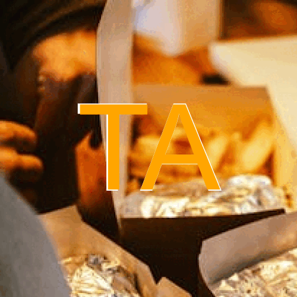

```{r setup, include=FALSE}
knitr::opts_chunk$set(echo=TRUE, message=FALSE, warning=FALSE, error=FALSE)
library(tidyverse)
selected_photos <- read_csv("selected_photos.csv")
```

```{css echo=FALSE}
body {
  background-color: black;
  color: white;
}

```

## Introduction

The two words I chose to use to search for photos on pexels.com were "crispy" and "potatoes", this is due entirely to the fact that I was hungry when I started the project. Another reason is also is that crispy potatoes are my favorite food and I couldn't think of anything else to use for images 

([crispy potatoes](https://www.pexels.com/search/crispy%20potatoes/))



1. most of the photos aren't actually about crispy potatoes but are about meals with crispy potatoes as a side dish
2. most of the photos were about fries instead of crispy potatoes
3. most of the photos had the fries (crispy potatoes) off to the side and out of focus

```{r}
knitr::kable(select(selected_photos, url))
```

## Key features of my selected photos

```{r include=FALSE}
mean_ratio <- selected_photos$display_ratio %>% mean(na.rm = TRUE)
mean_color_percent <- selected_photos$most_color %>% mean(na.rm = TRUE)
mean_width <- selected_photos$width %>% mean(na.rm = TRUE)
mean_text_length <- selected_photos$alt_length %>% mean(na.rm = TRUE)
```

1. The mean display ratio of the images is `r mean_ratio`, which means that most images are almost a square
2. The mean width of each images is `r mean_width`, so each image is around 4000x4000 pixels
3. The mean percentage that the highest color takes up in the image is `r mean_color_percent`, so most images are around 48% red
4. The mean alt text length is `r mean_text_length`, so each image takes about 80 words to describe

## Creativity



I wanted to make an anti-meme gif, so I thought it would be funny If it was just a gif of images of potatoes that had the word potato in the middle

I used some basic loops and operations to make the text colored, and to split the word "potato" into 3 parts "po", "ta", and "to"

I did this mainly because I thought it would make a better anti-meme

## Learning reflection

I liked learning the basics of accessing API's in r, but I would of liked to have done a more in-depth project with a much larger API

I think something interesting to explore would be using the statistics features in R in combination with API's to explore large data sets and gather information about them. One of the biggest reasons why I am interested in this is because I don't think R has any advantages over other languages in accessing API's in the conventional sense, python can already do pretty much everything we have done in this project but I think R would most likely be better equipped to analyzing a large API if we were examining if for a statistical purpose instead of creating a meme

## Appendix
```{r file='exploration.R', eval=FALSE, echo=TRUE}

```
```{r file='project3_report.Rmd', eval=FALSE, echo=TRUE}

```