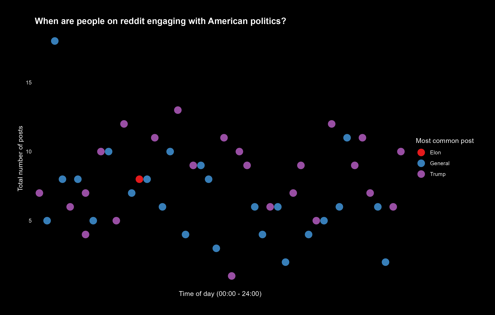
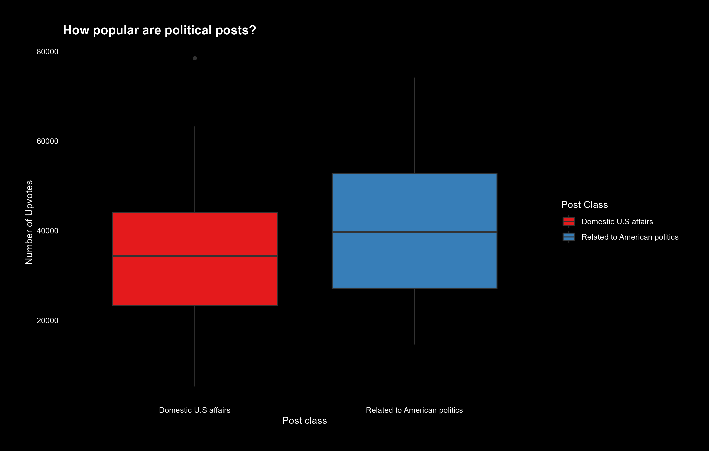
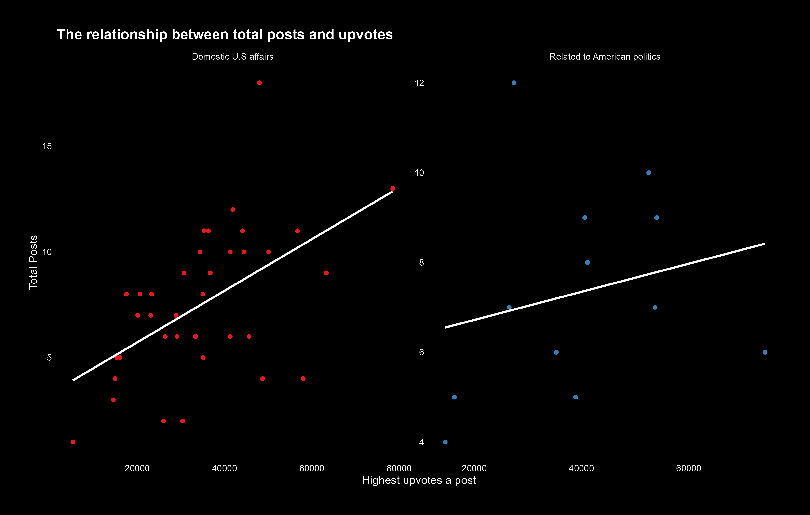

<script src="https://code.jquery.com/jquery-3.7.1.min.js" integrity="sha256-/JqT3SQfawRcv/BIHPThkBvs0OEvtFFmqPF/lYI/Cxo=" crossorigin="anonymous"></script>

```{r setup, include=FALSE}
knitr::opts_chunk$set(echo=FALSE, message=FALSE, warning=FALSE, error=FALSE)
```

```{js}
$(function() {
  $(".level2").css('visibility', 'hidden');
  $(".level2").first().css('visibility', 'visible');
  $(".container-fluid").height($(".container-fluid").height() + 300);
  $(window).on('scroll', function() {
    $('h2').each(function() {
      var h2Top = $(this).offset().top - $(window).scrollTop();
      var windowHeight = $(window).height();
      if (h2Top >= 0 && h2Top <= windowHeight / 2) {
        $(this).parent('div').css('visibility', 'visible');
      } else if (h2Top > windowHeight / 2) {
        $(this).parent('div').css('visibility', 'hidden');
      }
    });
  });
})
```

```{css}
.figcaption {display: none}
body {
  background-color: black;
  color: white;
  font-family: Helvetica, Arial, sans-serif;
}
```

## When are people using reddit for politics?



Looking at this plot, a couple of things stick out instantly

- The total number of posts seem to be sinusoidal
- The sinusoidal wave for the trump posts is higher than the wave for the general posts
- There seem to be peaks just before mid-day and just after the evening
- There seem to be dips early in the morning and around the evening

So we can make a couple of conclusions from this

- People tend to engage with Reddit after dinner and around lunch
- People tend not to engage with Reddit early in the morning and around dinner
- There tend to be more posts about trump than general political posts

It seems like posts oscillate throughout the day (as expected, due to most people working) and since the current political state of America is very divided it makes sense that there would be more posts about the current administration instead of general political posts


## How popular are political posts on reddit?



Looking at this plot, a couple of things stick out instantly

- The average number of upvotes for a post that is related to american politics is higher than posts relating to domestic U.S affairs
- The IQR for posts relating to domestic U.S affairs is smaller than posts that don't relate to U.S domestic affairs
- The minimum number of upvotes for a post not about domestic U.S affairs to be the most upvoted post is higher than posts about U.S domestic affairs
- The range of posts that don't directly relate to domestic U.S affairs is higher than posts that do relate to domestic U.S affairs

So we can make a couple of conclusions from this

- For a post that isn't related to domestic U.S affairs the minimum number of upvotes to be the most upvoted post about politics is higher than a post about domestic U.S affairs
- The above is most likely due to the fact that posts not about domestic U.S affairs tend to be memes or posts about american policy affecting other countries, since Reddit is mainly used in the U.S this would make that news much less popular unless it is a worldwide piece of news (e.g. just recently when the new pope was declared)
- Since domestic U.S affairs tends to relate to news they have a lower range of people wiling to upvote it, thus posts not about domestic U.S affairs have a higher reach

In general it seems like posts about domestic U.S affairs are upvoted more often, and thus the bar for the most upvoted post to be not related to domestic U.S affairs is higher


## When there are more political posts how do people engage with them?



Looking at this plot, a couple of things stick out instantly

- Both lines of best fit are positive
- Domestic U.S affairs posts seem to be less scattered than posts not about domestic U.S affairs

It makes sense that both lines are positive. We would expect that the more people are posting about politics the more upvotes the most upvoted post would have, since the number of users that browse Reddit don't really change day by day

Based off of the box-plot it also makes sense that the posts not relating to domestic U.S affairs would be more scattered, as the IQR for that boxplot is larger than the IQR of the box-plot for domestic U.S affairs

Based off of all of this data we can make a couple of conclusions

- People's use of Reddit oscillates throughout the day
- Posts relating to domestic U.S affairs are more popular than posts that do not relate to domestic U.S affairs
- Since posts not directly relating to domestic U.S affairs have a wider audience, the variance in the number of upvotes is higher


